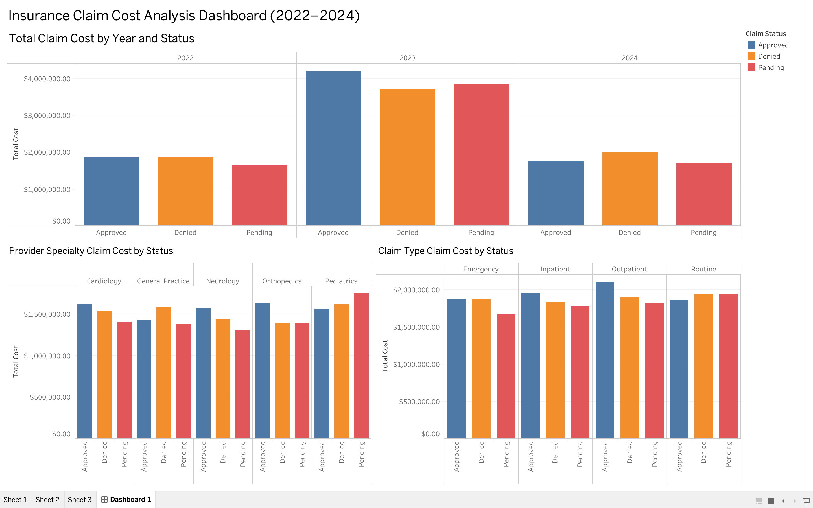

# insurance-claim-cost-analysis

SQL and Tableau project analyzing insurance claim cost patterns by claim status, provider specialty, and claim type from 2022 to 2024.

## Overview
This project analyzes insurance claims data from 2022 to 2024 to examine claim cost patterns across claim status, provider specialty, and claim type. Using SQL for data preparation and Tableau for visualization, the analysis highlights annual cost distribution and claims reporting trends.

## Objective
This analysis was designed to answer three main questions:
- How was claim cost distributed across Approved, Denied, and Pending claims from 2022 to 2024?
- Which provider specialties contributed the most to total claim cost?
- Which claim types contributed the most to total claim cost?

## Dataset
The project uses a synthetic insurance claims dataset covering claim activity from 2022 to 2024. Key fields include:
- Claim Amount
- Claim Date
- Claim Status
- Provider Specialty
- Claim Type
- Patient demographic and claim-related attributes

## Tools Used
- SQL
- Tableau

## Analysis Structure
The project was completed in three stages:

### 1. Yearly Claim Status Overview
Measured total claim cost by claim status across 2022, 2023, and 2024.

### 2. Provider Specialty Cost Analysis
Compared total claim cost across provider specialties and examined status-level cost patterns within each specialty.

### 3. Claim Type Cost Analysis
Compared total claim cost across claim types and examined status-level cost patterns within each claim type.

## Dashboard
The final Tableau dashboard includes three views:
- Total Claim Cost by Year and Status
- Provider Specialty Claim Cost by Status
- Claim Type Claim Cost by Status

## Key Findings
- 2023 showed the highest total claim cost across all three years.
- Claim costs were relatively balanced across Approved, Denied, and Pending claims.
- Pediatrics had the highest total claim cost among provider specialties.
- Outpatient claims contributed the highest total claim cost among claim types.

## Files
- [`Claims Analytics.sql`](Claims%20Analytics.sql) — SQL queries used for data preparation and summary tables
- [`enhanced_health_insurance_claims.csv`](enhanced_health_insurance_claims.csv) — source dataset
- [`yearly_claim_status_cost.csv`](yearly_claim_status_cost.csv) — yearly summary table
- [`provider_cost_summary.csv`](provider_cost_summary.csv) — provider specialty summary table
- [`claim_type_status_cost.csv`](claim_type_status_cost.csv) — claim type summary table
- [`insurance_claim_cost_analysis.twbx`](insurance_claim_cost_analysis.twbx) — final Tableau dashboard workbook

## Notes
This project uses a synthetic insurance claims dataset for portfolio analysis and dashboard development purposes.
